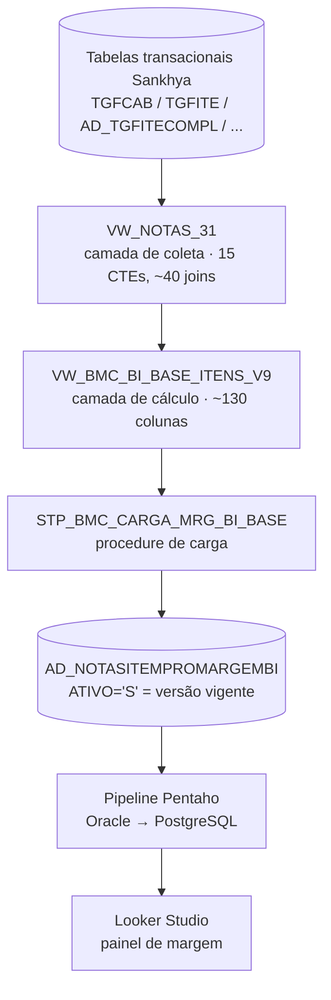
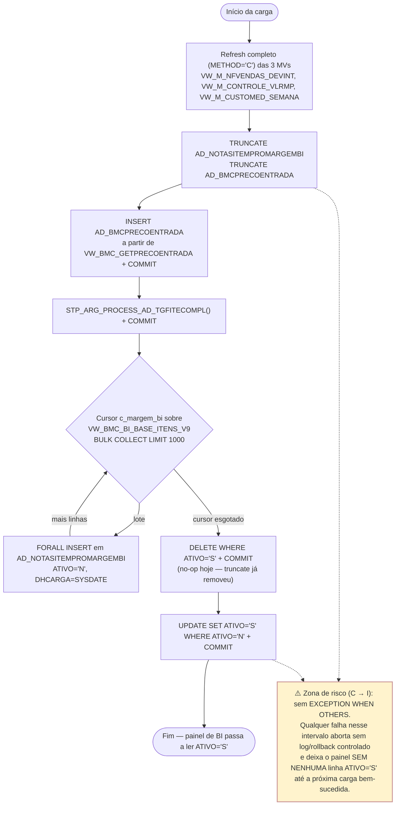
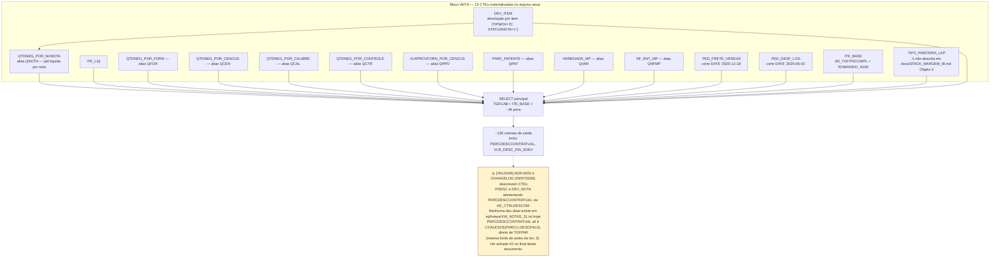
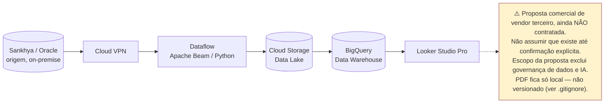
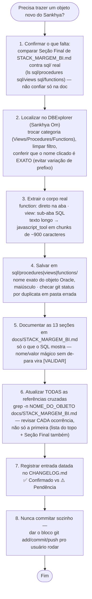
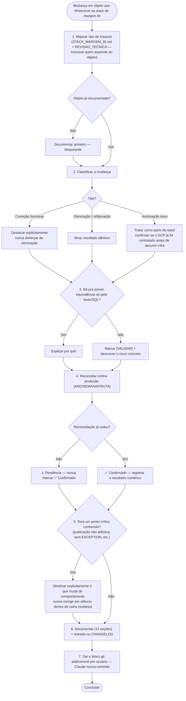

# Fluxos — Stack de Margem BI

Diagramas complementares à documentação textual (`ARCHITECTURE.md`, `docs/STACK_MARGEM_BI.md`, `docs/REVISAO_TECNICA_STACK_MARGEM_BI.md`). Renderizam nativamente no GitHub (Mermaid) — não é preciso ferramenta externa.

Convenção visual usada em todos os diagramas:

- Retângulo sólido = objeto trazido e documentado no repo (`sql/` + seção em `docs/`).
- Retângulo tracejado / subgrafo "`[EXTERNO]`" = referenciado na documentação mas ainda não trazido.
- Caixa amarela com ⚠️ = achado desta rodada de revisão (não é conteúdo normativo do stack, é um ponto a validar).

Cada diagrama foi construído a partir do texto já existente em `docs/` e, nos pontos em que a doc e o `.sql` real divergiam, a partir do `.sql` em `sql/` (fonte de verdade). Onde houve divergência entre os dois, ela está marcada explicitamente — ver Diagrama 4.

## 1. Visão geral — linhagem de dados ponta a ponta (stack atual)



Ponto cego conhecido: não há documentação do que acontece dentro do Pentaho (transformações, se alguma) nem de quais campos do Looker Studio são cálculo direto da coluna de origem vs. campo calculado dentro do próprio Looker Studio. Não coberto por nenhum diagrama abaixo — ninguém trouxe esse pedaço da cadeia para o repositório ainda.

## 2. Fluxo de execução — `STP_BMC_CARGA_MRG_BI_BASE`



## 3. Grafo de dependências — os 26 objetos documentados + pendências conhecidas

```mermaid
flowchart TD
    STP["STP_BMC_CARGA_MRG_BI_BASE (1)"]
    V9["VW_BMC_BI_BASE_ITENS_V9 (2)"]
    N31["VW_NOTAS_31 (3)"]

    STP --> V9
    V9 --> N31

    subgraph CUSTO["Custo / frete / portuária / provisão — Objetos 13–17"]
        OTM["VW_BMC_BI_CUSTOS_PROD_OTM (13)"]
        PACK["VW_BMC_BI_PERCA_PACK (14)"]
        FRMAR["VW_BMC_FRETE_MARITIMO (15)"]
        PORT["VW_BMC_DESPESAS_PORTUARIAS (16)"]
        PROVF["VW_BMC_BI_PROV_FORNECEDORES (17)"]
    end

    subgraph FUNC["Functions de cálculo — Objetos 4–12"]
        F4["FU_BMC_GETPROVFORN (4)"]
        F5["FU_BMC_GETROYALTIES (5)"]
        F6["FU_BMC_GETCOMVENDA (6)"]
        F7["FU_BMC_GETPERCCOMVENDA (7)"]
        F8["FU_BMC_GETCUSTOPREVISTO (8)"]
        F9["FU_ARG_TXADM_CUSTO_GER (9)"]
        F10["FUN_ARG_VLRETIQSRV (10)"]
        F11["FUN_ARG_VLRETIQ (11)"]
        F12["FU_BMC_PRECO_CUSTO_GER (12)"]
    end

    V9 --> OTM & PACK & FRMAR & PORT
    V9 --> F4 & F5 & F6 & F7 & F8 & F9 & F10 & F11 & F12

    subgraph QTDDEV["Quantidade / devolução / financeiro — Objetos 18–26"]
        Q18["VW_BMC_GET_QTD_DEV_VENDA (18)"]
        Q19["VW_BMC_GET_QTD_DEV_VENDA_FOR (19)"]
        Q20["VW_BMC_GET_QTD_DEV_VENDA2 (20)"]
        Q21["VW_ARG_DEB_CRE_ITE (21)"]
        Q22["VW_ARG_CRE_DEB (22)"]
        Q23["VW_DESCFIN (23)"]
        Q24["VW_PERCPROC_NF_V4 (24)"]
        Q25["VW_TGFCAB_ITE (25)"]
        Q26["VW_TGFPARC_TGFEMP (26)"]
    end

    N31 --> Q18 & Q19 & Q20 & PROVF & Q21 & Q22 & Q23 & Q24 & Q25 & Q26
    Q25 --> Q21
    Q26 --> Q22

    subgraph EXT["[EXTERNO] — referenciado, ainda não trazido para sql/"]
        MV1["VW_M_CUSTOMED_SEMANA"]
        MV2["VW_M_NFVENDAS_DEVINT"]
        MV3["VW_M_CONTROLE_VLRMP"]
        REC["VW_AD_REC_COMD<br/>⚠ erro consistente no DBExplorer ao abrir"]
        PROC2["STP_ARG_PROCESS_AD_TGFITECOMPL"]
        PRECOENT["VW_BMC_GETPRECOENTRADA / FU_BMC_GETPRECOENTRADA<br/>⚠ nome inconsistente entre os dois usos"]
        CUSTO4["obtemcusto4"]
    end

    STP --> MV1 & MV2 & MV3 & PROC2 & PRECOENT
    N31 --> MV1
    N31 --> REC
    OTM --> PRECOENT
    OTM --> CUSTO4
    F11 --> CUSTO4

    classDef pending stroke-dasharray: 5 5
    class MV1,MV2,MV3,REC,PROC2,PRECOENT,CUSTO4 pending
```



## 4. Grafo interno de CTEs — `VW_NOTAS_31`

Construído lendo direto `sql/views/VW_NOTAS_31.txt` (não só a prosa de `docs/STACK_MARGEM_BI.md`), porque as duas fontes divergem neste objeto — ver caixa de achado no diagrama.



## 5. Arquitetura futura proposta (GCP — Multiedro, **não contratada**)



## 6. Fluxo de trabalho — trazer e documentar um objeto Sankhya

> ⚠️ Este fluxo reflete o conteúdo de `skills/trazer-documentar-objeto/SKILL.md` **conforme criado no commit `ce3f439`**. Esse arquivo não existe mais no working tree — foi apagado 13 minutos depois, no commit `aa50339` (ver achado #1 no final deste documento). Reconstruído aqui a partir do histórico do Git só para preservar o conteúdo visualmente; não substitui a decisão de restaurar (ou não) o arquivo original.



## 7. Árvore de decisão — checklist de impacto em BI

> ⚠️ Mesma observação do diagrama 6: reconstruído a partir do conteúdo de `skills/bi-impact-check/SKILL.md` no commit `ce3f439`, que também não existe mais no working tree.



---

## Achados desta rodada de revisão (não são conteúdo normativo do stack)

Dois achados concretos, encontrados conferindo o `git log` e o `.sql` real contra a documentação — reportados aqui, não corrigidos silenciosamente (mesma regra que este repositório pede para todo o resto).

### 1. `skills/` foi apagada 13 minutos depois de criada

`skills/bi-impact-check/SKILL.md` e `skills/trazer-documentar-objeto/SKILL.md` são citadas como existentes em `README.md`, `ARCHITECTURE.md`, `CONTRIBUTING.md`, `sql/*/README.md` e no `docs/adr/0003-remover-claude-md-e-mover-skills-para-raiz.md` — mas não existem em lugar nenhum do working tree. `git log --name-status -- skills` mostra que o commit `aa50339` (17:07, 07/07/2026), 13 minutos depois do commit `ce3f439` (16:54) que finalizou essas duas skills, contém só duas remoções — nada mais:

```
aa50339  skills/bi-impact-check/SKILL.md          | 65 -----
aa50339  skills/trazer-documentar-objeto/SKILL.md | 85 -----
```

Tudo indica commit acidental (mesma mensagem de commit do anterior, nenhuma outra mudança). O conteúdo não está perdido — está no histórico do Git. Comando para restaurar os dois arquivos exatamente como ficaram em `ce3f439` (rodar você mesmo, não vou executar):

```
git checkout ce3f439 -- skills/bi-impact-check/SKILL.md skills/trazer-documentar-objeto/SKILL.md
git status
git commit -m "fix: restaura skills apagadas acidentalmente no commit aa50339"
```

### 2. `VW_NOTAS_31`: documentação e SQL real divergem sobre `PERCDESCCONTRATUAL`

`ADR-0002`, a entrada de `CHANGELOG.md` de 05/07/2026 e a nota de "Revisão (rev. 3)" no topo do Objeto 3 em `docs/STACK_MARGEM_BI.md` descrevem, como já implementado e com equivalência pendente de reconciliação: novas CTEs `PDESC` (baseada em `AD_CTRLDESCOM`, via `ROW_NUMBER`/`DHALTER<=DTNEG`/`RN=1`) e `DEV_NOTA`, com `PERCDESCCONTRATUAL` passando a vir de `PDESC`.

Conferido direto em `sql/views/VW_NOTAS_31.txt`: não existe CTE `PDESC` nem `DEV_NOTA`, não existe `AD_CTRLDESCOM`, não existe `ROW_NUMBER` no arquivo inteiro. `PERCDESCCONTRATUAL` (linha 595-596) é `COALESCE(PARCLI.DESCFIN, 0)` — direto de `TGFPAR`, a mesma fonte de antes da rev. 3. `VLR_DESC_FIN_SDEV` (linha 827-829) também usa `PARCLI.DESCFIN` diretamente, não uma CTE de devolução por nota. As próprias Seções 4, 6, 7 e 10 do Objeto 3 (Saídas, Cálculos, Dependências, Diagrama) nunca foram atualizadas para citar `PDESC`/`DEV_NOTA`/`AD_CTRLDESCOM` — só a nota de topo da rev. 3 fala nisso.

`[VALIDAR]` três hipóteses possíveis, nenhuma confirmável só pelo texto:
- (a) a mudança foi aplicada no Oracle mas o `.txt` local não foi re-sincronizado depois;
- (b) a mudança nunca chegou a ser aplicada no Oracle — o ADR registra uma decisão aceita, não necessariamente deployada;
- (c) foi aplicada e depois revertida no Oracle (por exemplo, se a reconciliação pendente tiver reprovado), sem atualizar ADR/CHANGELOG.

Como `PERCDESCCONTRATUAL` "alimenta desconto → alimenta margem" (linguagem do próprio `CHANGELOG.md`), vale confirmar qual das três é verdade antes de tratar a rev. 3 como vigente em qualquer decisão.

Achado secundário, mesmo objeto: o arquivo real tem **15 CTEs** (incluindo `DEV_ITEM`, adicionada na rev. 3, e `TIPO_PARCERIA_LKP`, que não é mencionada em nenhuma seção do Objeto 3), não as "13 CTEs" que a Seção 2 ainda descreve.
